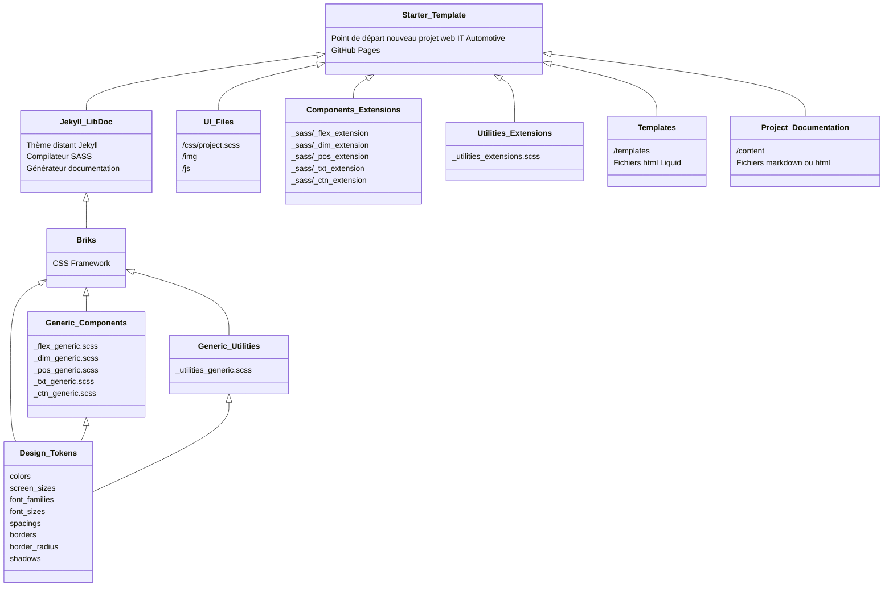

# starter-template

Point de départ pour tout nouveau projet web utilisant le système de design de IT Automotive. Ce dépôt est un clone de [Jekyll LibDoc](https://olivier3lanc.github.io/Jekyll-LibDoc/) personnalisé pour ITADS.



## Rôle du starter-template

* **Créer les templates** du projet avec son environnement complet (générique + personnalisé) du système de design IT Automotive.
* **Créer la documentation des extensions de composants**, la documentation qui n'est pas incluse dans la documentation des composants génériques.

## Codespaces

Ce projet peut être développé avec Github codespaces


## Installation locale avec Jekyll LibDoc distant

1. Cloner ce dépôt.
2. Installer Jekyll sur votre machine en suivant les [instructions](https://jekyllrb.com/docs/)
3. Ajouter un Gemfile contenant la ligne suivante

  ```ruby
  gem "jekyll-remote-theme"
  ```
  et exécuter `bundle install` pour installer le plugin.
4. Ajouter les lignes suivantes dans votre fichier de configuration LibDoc `_<NOM DU FICHIER>.yml`

  ```yml
  remote_theme: ita-design-system/jekyll-libdoc
  plugins:
    - jekyll-remote-theme
  ```
5. Exécuter `jekyll build` ou `jekyll build -c _votre-fichier-config.yml`

## Démarrage

Le starter-template contient l'arborescence des fichiers compilés:

```
ui/
├── css/
│   └── briks.scss (point d'entrée)
├── img
└── js
```

Les fichiers de composants génériques se trouvent dans le dépôt [jekyll-libdoc/_sass/briks](https://github.com/ita-design-system/jekyll-libdoc/tree/main/_sass/briks)

Le point d'entrée SASS est le suivant [ui/css/briks.scss](ui/css/briks.scss)

```scss
/*
    POINT D'ENTRÉE BRIKS
*/

/*
    CORE
    Fonctionnalités principales 
    Inclure briks/_core.scss pour obtenir les fonctions helpers et les mixins.
    Aucune déclaration CSS n'est générée à partir de ce fichier.
*/
@import 'briks/core';
/*
    DESIGN TOKENS
    Fichier SASS contenant les design tokens de briks
*/
@import 'briks/settings/tokens/generic';
/*
    CSS VARIABLES
    Requiert briks/_core.scss
    Ce fichier génère les variables CSS de briks
*/
@import 'briks/css-vars';
/*
    FONTS
    Requiert briks/_core.scss
    Génère les déclarations CSS nécéssaires pour l'usage des typos
*/
@import 'briks/fonts';
/*
    COMPOSANTS GÉNÉRIQUES
    Requiert briks/_core.scss
    Imports des fichiers de configurations des composants génériques.
    Ces fichiers sont présents dans le dépôt
    https://github.com/ita-design-system/jekyll-libdoc/tree/main/_sass/briks
*/
@import 'briks/flex_generic';
/*
    EXTENSIONS
    Requiert briks/_core.scss
    Imports des fichiers de configurations des extensions de composants.
    Ces fichiers doivent être placés dans ce dépôt dans le répertoire _sass
*/
@import 'flex_extension';

/*
    GÉNÉRATEUR DE COMPOSANTS
    Requiert  briks/_core.scss
    Génère toutes les déclarations CSS des composants
*/
@import 'briks/components';
```