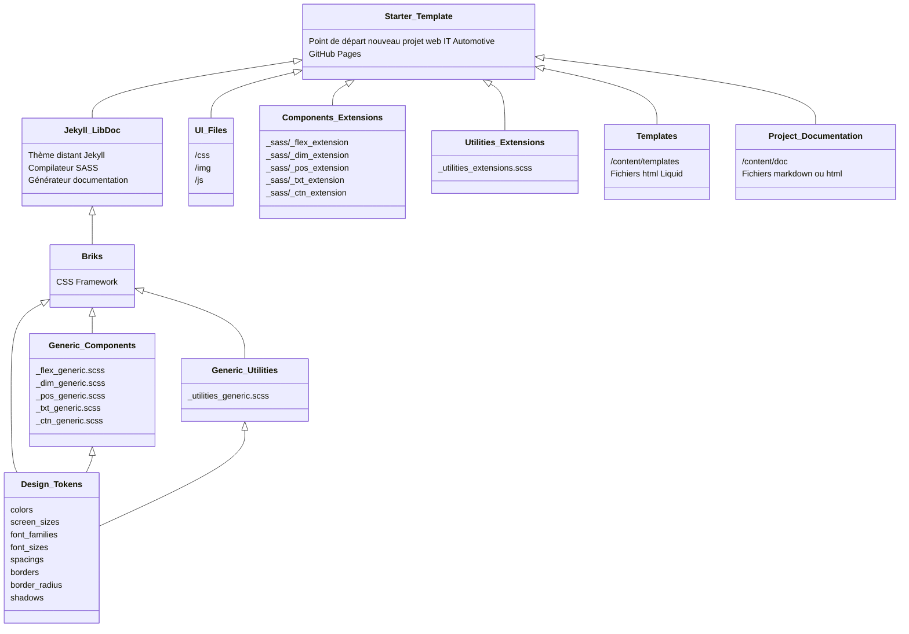

# starter-template

Point de départ pour tout nouveau projet web utilisant le système de design de IT Automotive. Ce dépôt est un clone de [Jekyll LibDoc](https://olivier3lanc.github.io/Jekyll-LibDoc/) personnalisé pour ITADS.



## Rôle du starter-template

* **Créer les templates** du projet avec son environnement complet (générique + personnalisé) du système de design IT Automotive.
* **Créer la documentation des extensions de composants**, la documentation qui n'est pas incluse dans la documentation des composants génériques.

## Codespaces

Ce projet peut être développé avec Github codespaces


## Installation locale avec Jekyll LibDoc distant

1. Cloner ce dépôt.
2. Installer Jekyll sur votre machine en suivant les [instructions](https://jekyllrb.com/docs/)
3. Ajouter un Gemfile contenant la ligne suivante

  ```ruby
  gem "jekyll-remote-theme"
  ```
  et exécuter `bundle install` pour installer le plugin.
4. Ajouter les lignes suivantes dans votre fichier de configuration LibDoc `_<NOM DU FICHIER>.yml`

  ```yml
  remote_theme: ita-design-system/jekyll-libdoc
  plugins:
    - jekyll-remote-theme
  ```
5. Exécuter `jekyll build` ou `jekyll build -c _votre-fichier-config.yml`

## Démarrage

Le starter-template contient l'arborescence des fichiers:

```
ui/
├── css/
│   ├── briks_css_variables.scss
│   ├── briks_dim_extension.scss
│   ├── briks_dim_generic.scss
│   ├── briks_flex_extension.scss
│   ├── briks_flex_generic.scss
│   ├── briks_fonts.scss
│   ├── briks_pos_extension.scss
│   ├── briks_pos_generic.scss
│   ├── briks_skin_extension.scss
│   ├── briks_skin_generic.scss
│   ├── briks_txt_extension.scss
│   ├── briks_txt_generic.scss
│   ├── briks_utilities_generic.scss
│   └── briks_utilities_extension.scss
├── medias
└── js
```

## Scope des composants

Le diagramme ci-dessous reprend la portée des propriétés CSS des composants.

```mermaid
classDiagram
    class c_flex {
        display: flex
        align-items
        justify-content
        flex-wrap
        flex-direction
        gap
    }
    class c_dim {
        flex-grow
        height
        margin
        max-height
        max-width
        min-height
        min-width
        order
        overflow
        padding
        width
    }
    class c_pos {
        position
        top
        right
        bottom
        left
        transform
        z-index
    }
    class c_txt {
        display: -webkit-box
        font-family
        font-size
        font-style
        font-weight
        letter-spacing
        line-height
        text-align
        text-decoration
        text-overflow
        text-transform
        vertical-align
        white-space
        word-break
        -webkit-box-orient
        -webkit-line-clamp
    }
    class c_skin {
        background
        border
        border-radius
        box-shadow
        color
        cursor
        list-style
        opacity
        outline
        pointer-events
        transition
    }
 ```
 
 ## Abréviations utilisées

Abréviations désignant les propriété CSS.

| Propriété CSS | Abréviation |
|:-|:-|
| aspect-ratio | `ar-` |
| background | `bg-` |
| background-color | `bc-` |
| background-image | `bi-` |
| background-position | `bpos-` |
| background-repeat | `brep-` |
| background-size | `bsize-` |
| border | `b-` |
| border-top | `bt-` |
| border-right | `br-` |
| border-bottom | `bb-` |
| border-left | `bl-` |
| border-radius | `brad-` |
| border-top-left-radius | `bradtl-` |
| border-top-right-radius | `bradtr-` |
| border-bottom-right-radius | `bradbr-` |
| border-bottom-left-radius | `bradbl-` |
| bottom | `bottom-` |
| box-shadow | `bs-` |
| break-after | `ba-` |
| color | `c-` |
| cursor | `cur-` |
| display | `d-` |
| font-family | `ff-` |
| font-size | `fs-` |
| font-style | `fstyle-` |
| font-weight | `fw-` |
| height | `h-` |
| left | `left-` |
| letter-spacing | `lsp-` |
| line-height | `lh-` |
| list-style | `ls-` |
| margin | `m-` |
| margin-top | `mt-` |
| margin-right | `mr-` |
| margin-bottom | `mb-` |
| margin-left | `ml-` |
| max-height | `maxh-` |
| max-width | `maxw-` |
| min-height | `minh-` |
| min-width | `minw-` |
| opacity | `opa-` |
| order | `order-` |
| overflow | `o-` |
| padding | `p-` |
| padding-top | `pt-` |
| padding-right | `pr-` |
| padding-bottom | `pb-` |
| padding-left | `pl-` |
| pointer-events | `pe-` |
| pos | `pos-` |
| right | `right-` |
| text-align | `ta-` |
| text-decoration | `td-` |
| text-transform | `tt-` |
| transition | `transition-` |
| top | `top-` |
| vertical-align | `va-` |
| visibility | `v-` |
| word-break | `wb-` |
| white-space | `ws-` |
| width | `w-` |
| z-index | `z-` |
